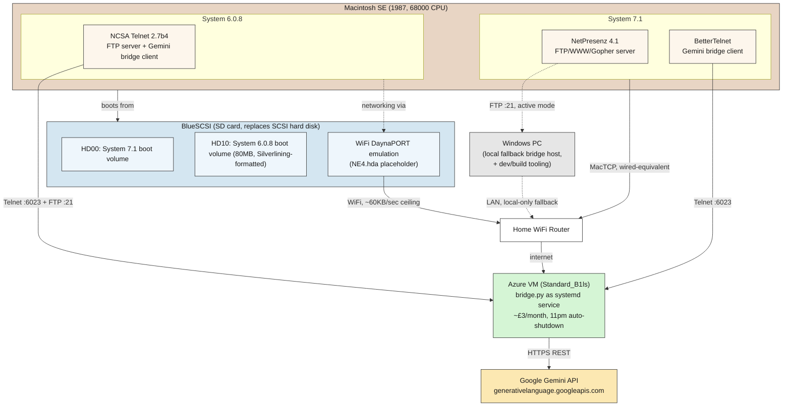
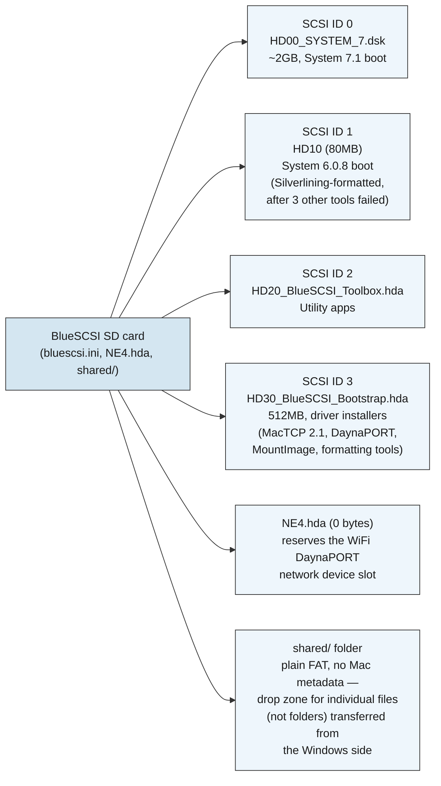
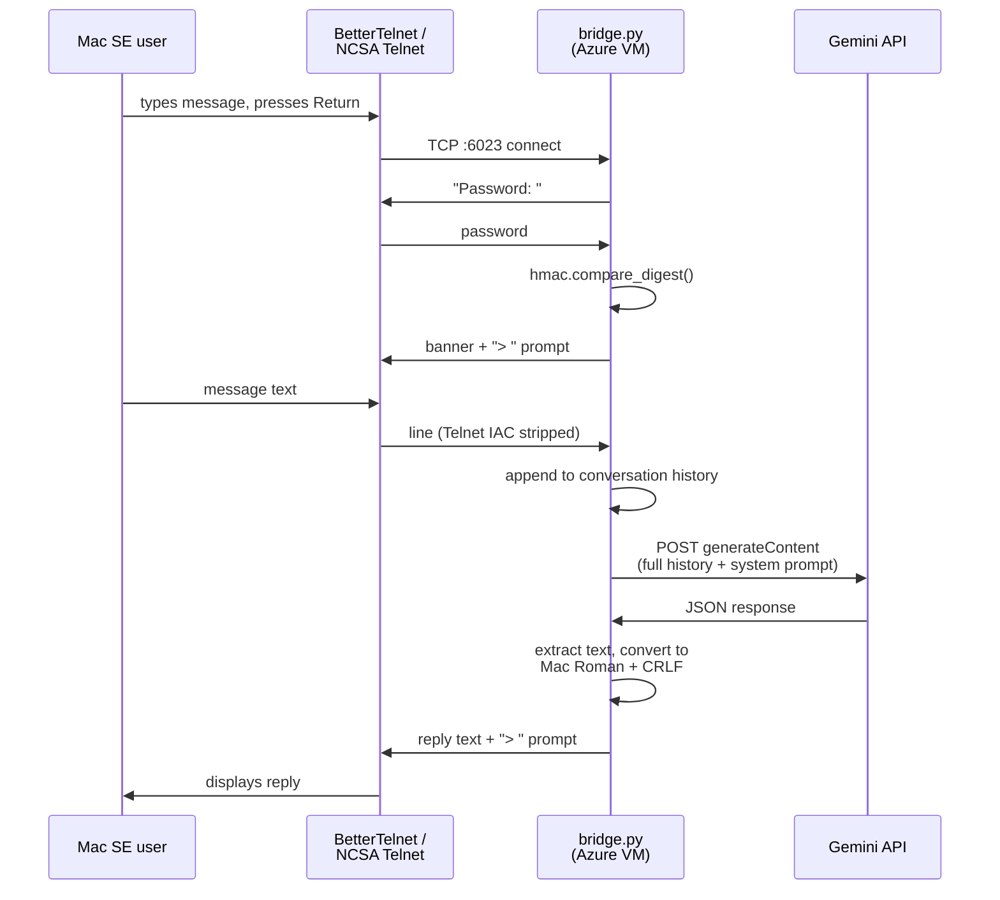
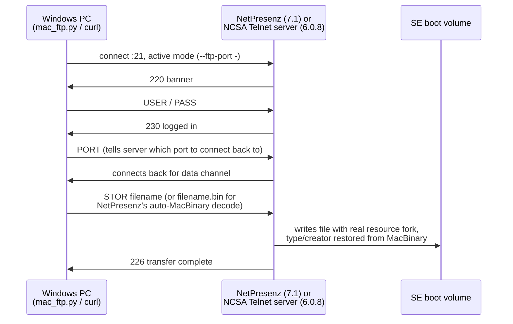
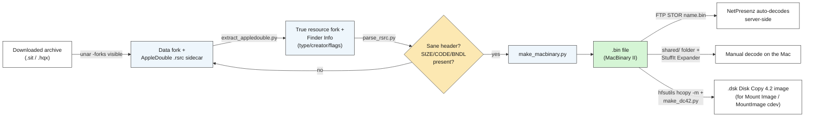

# Architecture

Visual companion to [`README.md`](./README.md) (the practical reference)
and [`SESSION_SUMMARY.md`](./SESSION_SUMMARY.md) (the full build narrative,
including every wrong turn). This file focuses on how the finished system
actually fits together.

## System overview

Key points this diagram is making:
- The SE **dual-boots** two separate classic Mac OS versions from the same
  BlueSCSI SD card, each with its own boot volume and its own Telnet
  client/FTP server combination — NetPresenz can't run on System 6 at all
  (needs Personal File Sharing, a 7.x-only feature), and BetterTelnet
  crashes on this specific SE under System 6.0.8 (likely a Color QuickDraw
  dependency the SE's ROM doesn't have), so each OS ended up with a
  different, non-interchangeable pair of tools.
- Networking on the **System 6.0.8** side is entirely virtual — BlueSCSI's
  WiFi DaynaPORT feature emulates a SCSI-attached network card over the
  Pico W's onboard WiFi radio, with a fixed ~60KB/sec throughput ceiling
  regardless of which classic Mac OS version sits on top of it.
- The **Gemini bridge** (`bridge.py`) can run on either an Azure VM
  (recommended — reachable from anywhere the SE has internet, no LAN
  dependency) or a Windows PC on the same LAN (local/dev fallback, also
  where all the build/packaging tooling lives).

## SD card SCSI layout

Every configured SCSI ID mounts **simultaneously** regardless of which one
the Mac actually boots from — a real gotcha during the DaynaPORT saga (see
`SESSION_SUMMARY.md`), since old installers that enumerate all mounted
volumes could choke on an oversized one that had nothing to do with the
actual install target.

## Chat flow (Gemini bridge)

## FTP file transfer flow

Two different servers depending on which OS is booted, but the same
active-mode requirement either way (classic MacTCP handles passive-mode
FTP unreliably — confirmed via NetPresenz Setup's own Summary panel
reporting "Open Transport is not installed"):

## Classic Mac software packaging pipeline

The repeatable process (`tools/`) used to get NetPresenz, BetterTelnet,
and NCSA Telnet onto the SE correctly — i.e. with real resource forks and
type/creator codes intact, not just raw data:

The `extract_appledouble.py` step exists because of a real bug hit early
in this project: `unar -forks visible` doesn't write a bare resource fork
to its `.rsrc` sidecar — it wraps the resource fork *and* Finder Info
together in an AppleDouble container (magic `00 05 16 07`). Treating that
sidecar as a raw resource fork silently corrupts the app (extra header
bytes shift every resource offset), which is exactly what happened once —
Finder showed a generic icon and the app failed to launch with error `-50`
until it was diagnosed and fixed.

## Design decisions worth noting

- **Why `bridge.py` calls Gemini's REST API directly instead of the
  `gemini` CLI**: the CLI hung unpredictably for reasons unrelated to the
  API itself (confirmed independently — direct CLI invocations hung too,
  while the raw REST endpoint responded in ~1-2 seconds every time). Using
  `urllib` directly removed the Node.js/npm dependency entirely as a side
  effect.
- **Why active-mode FTP everywhere**: classic MacTCP (not Open
  Transport — this SE's 68000 CPU is below OT's official 68030 minimum, so
  it can never be upgraded to it) handles passive-mode FTP unreliably.
  Every FTP client interaction in this project (`mac_ftp.py`, manual
  `curl` testing) forces active mode for this reason.
- **Why the Azure VM is the cheapest tier (`Standard_B1ls`)**: `bridge.py`
  is pure-stdlib Python with a negligible memory footprint — there's
  nothing here that benefits from more than 1 vCPU / 0.5GB RAM.
- **Why `BRIDGE_PASSWORD` exists at all**: the local-LAN version of the
  bridge had zero authentication, which was fine when only trusted home
  devices could reach it. Moving to a public Azure VM changed the threat
  model — anyone who found the IP/port could otherwise chat using the
  owner's Gemini API quota. Constant-time comparison
  (`hmac.compare_digest`) and a short delay between attempts were added to
  avoid the most trivial abuse, without building out a full auth system
  for what's still fundamentally a personal project.
